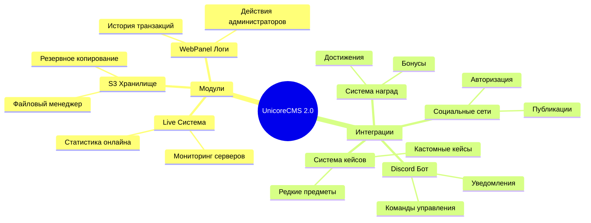

# UnicoreCMS 2.0 Developer

<div align="center">
  


[](https://demo.unicorecms2.ru/)
[](https://demo.unicorecms2.ru/)

</div>

<br/>

<div align="center">

# ⭐ Установка UnicoreCMS 2.0

<div style="background: linear-gradient(45deg, #1488CC, #2B32B2); padding: 20px; border-radius: 10px; margin: 20px 0;">

### 💫 Базовая установка системы
```css
⚡ Полная установка UnicoreCMS 2.0
⚡ Базовая настройка компонентов
⚡ Интеграция с игровым сервером
⚡ Настройка безопасности
⚡ Техническая поддержка
⚡ Обучение администраторов
```

### 💎 Стоимость: 3500₽
Единоразовый платёж за полную установку

</div>

</div>

<br/>

## ⚙️ Совместимость

<div align="center">

[](https://gml.recloud.tech/)

### 🎯 Эксклюзивная интеграция с GML Launcher

```css
✓ Полная совместимость со всеми версиями GML Launcher
✓ Автоматическая синхронизация данных
✓ Интегрированная система авторизации
✓ Поддержка всех типов ядер: Vanilla, Forge, Fabric, NeoForge, LiteLoader, Quilt
```

</div>

<br/>

## 🌐 Услуги для сайта

<div align="center">

### Основные модули

| Модуль для UnicoreCMS 2.0 | Описание | Зависимости | Стоимость |
|:----------------------|:---------|:------------|----------:|
| 🏆 Форум | Полноценный форум для проекта | - | 10000₽ |
| 👑 Выдача Админ прав | Управление правами через сайт | - | 4500₽ |
| 🆘 Я застрял | Система помощи игрокам | - | 4000₽ |
| 📸 Модуль скринов | Скриншоты с сервера | - | 3000₽ |
| 👥 Команда проекта | Управление персоналом | Заявка в персонал | 3000₽ |
| 📝 Заявка в персонал | Набор персонала | - | 2500₽ |
| 🔌 API для форума IPS | Интеграция с форумом | - | 2500₽ |
| 🤖 Discord WebHook | Уведомления о заявках | Заявка в персонал | 1300₽ |

### Платёжные модули

| Способ оплаты | Стоимость |
|:--------------|----------:|
| 💳 Пополнение через ЮКасса | 2500₽ |
| 💰 Пополнение через AAIO | 2500₽ |
| 💵 Пополнение через CloudPayments | 2500₽ |
| 💸 Пополнение через Lava | 2500₽ |

</div>


<br/>

## 🎮 Игровые услуги

<div align="center">

| Тип | Название | Версия | Стоимость |
|:----|:---------|:-------|----------:|
| 🎯 Ядро | Серверное ядро | 1.7.10 | 6500₽ |
| 👤 Мод | Персонализация | 1.7.10 | 7000₽ |
| 💬 Мод | AdvancedChat | 1.7.10 | 4000₽ |
| 📋 Мод | CustomTabList | 1.7.10 | 2000₽ |
| 🌍 Мод-Плагин | WorldRender | 1.7.10 | 2000₽ |

</div>

<br/>

## 🚀 В разработке

<div align="center">



</div>

<br/>

## 💻 Технологический стек

<div align="center">
  <table>
    <tr>
      <td align="center" width="96">
        
        <br>JavaScript
      </td>
      <td align="center" width="96">
        
        <br>Java
      </td>
      <td align="center" width="96">
        
        <br>PHP
      </td>
      <td align="center" width="96">
        
        <br>Git
      </td>
      <td align="center" width="96">
        
        <br>TypeScript
      </td>
    </tr>
    <tr>
      <td align="center" width="96">
        
        <br>React
      </td>
      <td align="center" width="96">
        
        <br>Vue
      </td>
      <td align="center" width="96">
        
        <br>Next.js
      </td>
      <td align="center" width="96">
        
        <br>Nuxt.js
      </td>
      <td align="center" width="96">
        
        <br>Node.js
      </td>
    </tr>
    <tr>
      <td align="center" width="96">
        
        <br>MySQL
      </td>
      <td align="center" width="96">
        
        <br>Laravel
      </td>
      <td align="center" width="96">
        
        <br>Linux
      </td>
      <td align="center" width="96">
        
        <br>VS Code
      </td>
      <td align="center" width="96">
        
        <br>Docker
      </td>
    </tr>
  </table>
</div>


<br/>

## 📊 Статистика

<div align="center">
  
  <br/><br/>
  
</div>

<br/>

## 📱 Связь

<div align="center">


[](https://discord.com/users/s.one)
[](https://github.com/Nik497926)
[](https://t.me/nikita497926)

</div>

<br/>


<div align="center">


  
</div>
